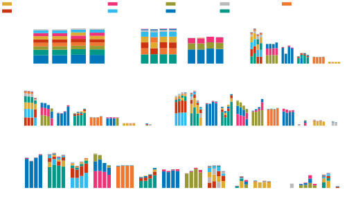
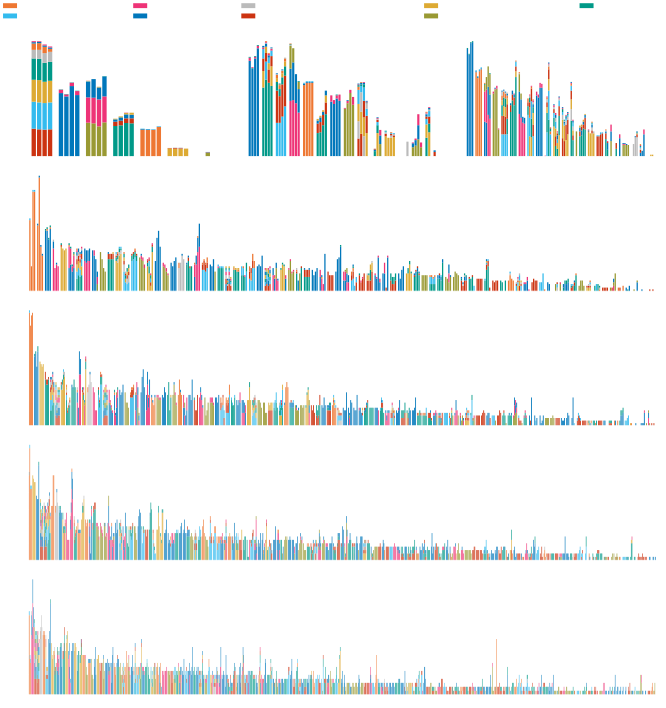

# Finding Deeper Community Structures: The Networks of Portuguese Universities

This project was elaborated as a project for the class of Complex Analysis. This is the [link](https://github.com/bernardo-silva/NetworkScienceProject) to the github repository.

The final report can be read [here](REPORT.pdf).

If you want to run the code, the main dependencies are:

    networkx
    numpy
    matplotlib
    pandas
    python-louvain
    fuzzywuzzy
    scipy
    tqdm
    tabulate
    
The folder [Networks Info](/Networks Info) contains information about every node of the networks.
The folder [images](/images) contains some images.

## Greedy Modularity Communities with R&B parameter

---

